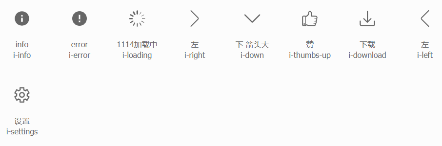

# 按钮
&nbsp;
<ClientOnly>
  <button-demo-1></button-demo-1>
</ClientOnly>

```html
<g-button-group>
  <g-button icon="left">上一页</g-button>
  <g-button>4</g-button>
  <g-button>5</g-button>
  <g-button>6</g-button>
  <g-button>7</g-button>
  <g-button>8</g-button>
  <g-button>9</g-button>
  <g-button icon="right" icon-position="right">下一页</g-button>
</g-button-group>
```
* 设置<span style='color:#3eaf7c;background-color:#F8F8F8'> icon </span>属性在 Button 内嵌入一个 Icon。  
* 通过设置<span style='color:#3eaf7c;background-color:#F8F8F8'> iconPosition </span>属性改变 Icon 在 Button 中的位置，仅支持“左，右”两个位置。
* 设置<span style='color:#3eaf7c;background-color:#F8F8F8'> loading </span>属性，可以让按钮处于加载中状态。
* 通过设置<span style='color:#3eaf7c;background-color:#F8F8F8'> disabled </span>属性，可将按钮设置为不可用状态。

默认可设置icon为一下几种：

